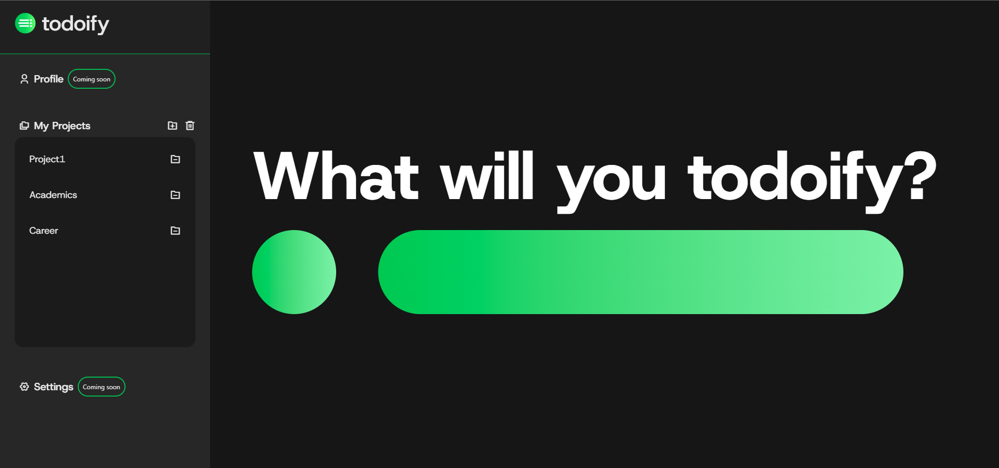

# The Odin Project
## Custom To-do list 

*todoify* is a customizable to-do app that goes beyond checklists. it syncs your tasks and projects with music from your spotify playlist that matches your mood, energy, or focus level.

### To be added (Hopefully):

- Integrate with Spotify web api 
- Link a specific song with a task/project depending on urgency
- Embed a spotify player



## Get started

**You can view the todo list webapp using the `github.io` link in the right side**

or

**Setup it up locally**

1. Make sure to install dependencies
```
# npm
npm install

# pnpm
pnpm install
```
2. Start the development server using vite

```
# pnpm
pnpm run dev
```
3. Building the webapp as a production 
```
# pnpm
pnpm build
```
4. Locally preview the production build
```
# pnpm
pnpm review
```

